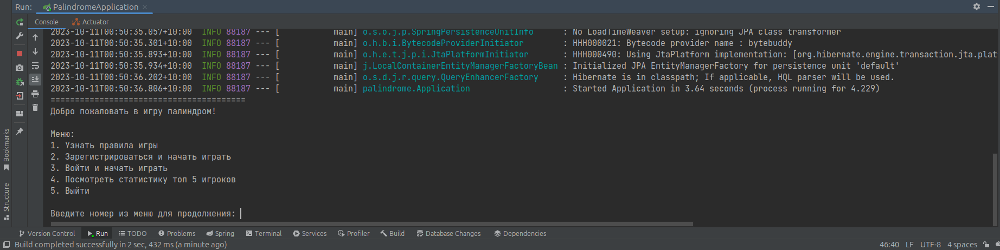
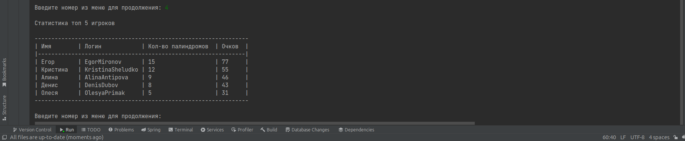
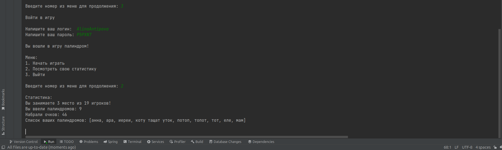
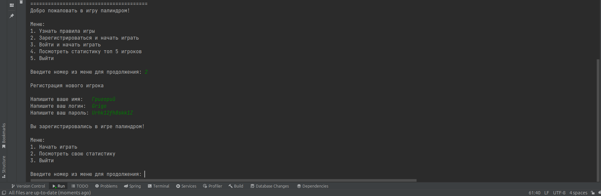
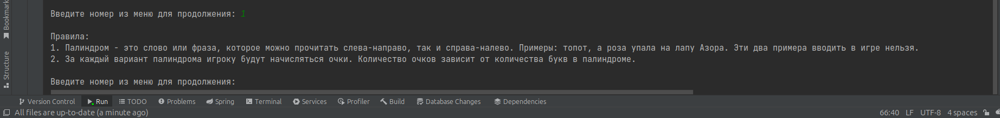

## Игра палиндром рабочая. Можно поиграть. Играет музыка на фоне.

### Как запустить игру
Есть два варианта: через jar файл или через среду разработки.

Если через jar файл, то настраивает базу данных, как написано ниже, переходим в корень проекта, где jar файл и вводим команду: "java -jar palindrome-1.jar". В терминале запустится игра палиндром.

Если через среду разработки, то в пакете utils есть класс "ConstantsUtils". Там нужно найти константу "PATH_TO_MUSIC_FILE". Указываем путь к музыке под вашу систему. Сама музыка уже есть в папке "resources".

Нужно скачать docker, postgres и запустить базу данных.
```
docker run --name postgres_db -p 5432:5432 -e POSTGRES_USER=palindrome -e POSTGRES_PASSWORD=palindrome -d postgres:15.4
```

Если команда выше даст ошибку (нет прав)
```
docker: Got permission denied while trying to connect to the Docker daemon socket at unix:///var/run/docker.sock
```
Открываем терминал, переходим в папку /var/run/ и вводим команду:
```
sudo chmod 777 docker.sock
```

Файлу docker.sock будут выданы права и команда с пункта 2 заработает.

По умолчанию будет создана база данных с названием postgres.

Подключаемся к базе данных:
```
Хост с портом: localhost:5432
Логин: palindrome
Пароль: palindrome
Название базы данных: postgres
```

Команда из пункта 2 по умолчанию создаст базу данных с названием 'palindrome'. Переименовываем ее на 'palindrome_db' командой ниже.
```
ALTER DATABASE palindrome RENAME TO palindrome_db;
```

Далее нужно запустить саму игру палиндром через файл Application (файл в папке palindrome).

При запуске приложения запустится Flyway и создаст 3 таблицы: users, palindromes, stats.

```
users - id записи, логин, пароль, дата последнего входа
palindromes - id записи, палиндром, id пользователя, который написал палиндром
stats - id записи, id пользователя, кол-во написанных палиндромов, всего очков
```

Также будут заполнены эти таблицы тестовыми данными.

Можно зарегистрировать своего пользователя и поиграть в игру палиндром или войти под уже существующими пользователями. На разных пользователях своя статистика (сколько очков они набрали, и какие палиндромы указали).

### Данные 10 пользователей
| Имя      | Логин            | Пароль  | Кол-во палиндромов | Очков |
|----------|------------------|---------|--------------------|-------|
| Егор     | EgorMironov      | QK9P2A  | 15                 | 77    |
| Кристина | KristinaSheludko | W993D6  | 12                 | 55    |
| Денис    | DenisDubov       | ZA5LTS  | 8                  | 43    |
| Алина    | AlinaAntipova    | P5PXN7  | 7                  | 40    |
| Олеся    | OlesyaPrimak     | GJA25X  | 5                  | 31    |
| Алексей  | AlexSmirnov      | 5VJZ7V  | 4                  | 27    |
| Максим   | MaximNagorniy    | VPR3LF  | 6                  | 22    |
| Полина   | PolinaOsipenko   | UV4LE2  | 4                  | 18    |
| Никита   | NikitaAntonov    | 2DM4AM  | 3                  | 13    |
| Виктория | ViktoriaPronina  | SE2NMP  | 1                  | 3     |

При запуске игры появится меню. Выбираем нужный вариант и играем в игру.

### Несколько скриншотов из игры
Стартовое меню:


Статистика топ 5 игроков:


Статистика игрока:


Регистрация нового игрока:


Правила игры:


### Написано 14 методов на J-Unit

### Мои контакты
| Имя      | Номер + WhatsApp | Telegram           | Почта                 |
|----------|------------------|--------------------|-----------------------|
| Григорий | 8-924-116-18-34  | posmitniy_grigoriy | pga.profile@gmail.com |